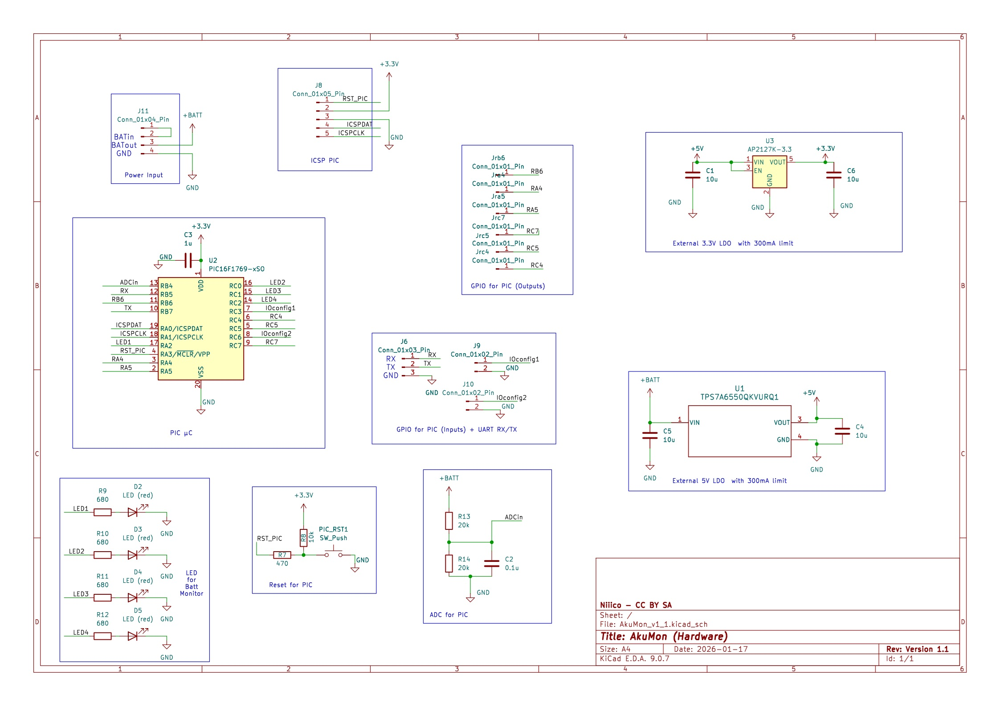
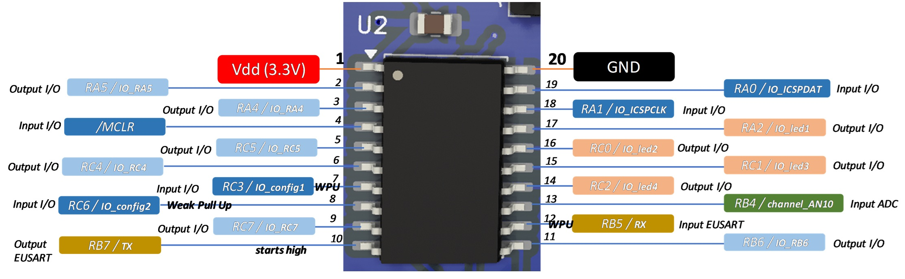
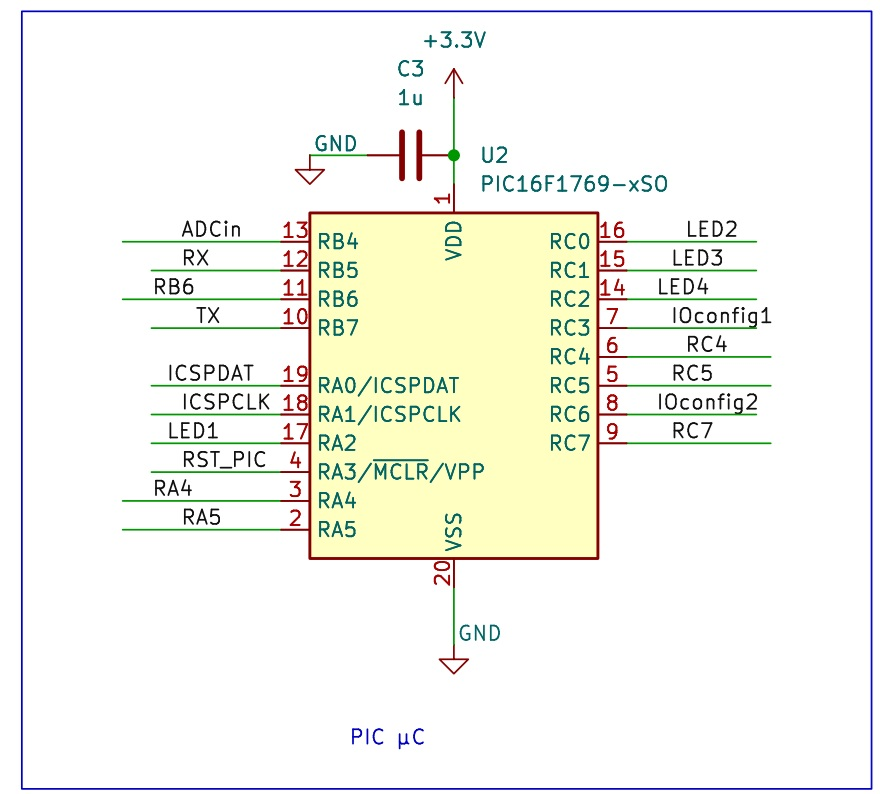

# AkuMon
Open Source battery monitor based on µC, ADC, LDO and LEDs

This project if for the hardware! Please check related software
at https://github.com/NicoRouger/AkuMon_Software

License: CC BY SA 4.0

[X] Tested schematics.

## Purpose

Measure the input battery voltage, scaled with resistor divider bridge, convert to 8 or 10 bits, compare with a stable reference from LDO and internal thresholds, and 
output the value in 4 LEDs (e.g. 10%, 25%, 50%, 80% battery State of Charge).

Some interesting features of the µC could also be used, such as UART, High Endurance Flash (to store/log SOC evolution), PWM (to dim LEDs or modulate data), timers, sleep mode, ...

# Main features of AkuMon:

- Initially developed in a *dual core* approach to monitor battery state of charge (SOC) of a DIY Arduboy FX clone, in an arcade bartop https://github.com/NicoRouger/ArduStick
- NiMH battery & more - can be selected with two config bits (4 states: Alka, NiMH, LiPoly, or 9V batt, see related software repo for more info.)
- regulated 5 V & 3.3 V on board
- possibility of other i/o from pic16f and uart
- can be supplied from 4xAAA, 4xAA (NiMH or Alkaline OK), also from LiPoly and 9V battery, thanks to added 40V LDO!
- 10 bits ADC to convert battery voltage level in digital value
- 1/2 or 1/3 resistor divider bridge used from input voltage
- Show battery level with 4x LEDs

# Design consideration

## Microcontroller
PIC16F1769 was used due to:
- 3.3 V and 5V compatible (supply and I/O)
- Through hole and Surface mount available packaging
- Many I/O
- Many peripherals, including EUSART, High Endurance Flash, Timers, ADC, ...
- < 2 €

Cons: requires a specific programming tool (e.g. snap or basic programmer).

Many other microcontrollers can be used, compatible or not with Arduino IDE (this one is not!).

## Other aspects
10 bit ADC (with only 8 MSB used in software)

Internal FRC oscillator (no need of external cristal oscillator)

Battery input is from 3 V to 10 V

PIC is supplied from a LDO (3.3 V output, 2.5 V to 6 V input, 300 mA max current), but all I/O and supply are compatible with 3.3 and 5 V

Another 5V LDO is used before the 3.3 LDO, in case 9V batteries are used (TPS7A6550QKVURQ1, 5 V output, UVLO at 3.16 V, max 40 V input, 300 mA). Beware, this 5V LDO is a Moisture Sensitive Device (Level 3)

4 LEDs are used to monitor the input battery voltage level

ICSP socket is included for in circuit serial programming

Divider bridge is typically 1/2 or 1/3. To reduced current drawn, these resistors are equal or higher than 20 kOhms, with a 100 nF capacitor to comply with ADC requirements in that case.

2 inputs (IO_config1,2) are used to select 4 different battery types (NiMH, Alkaline, LiPo, and 9V albeit with a change of resistor divider). With internal Weak Pull Up included

1 /MCLR pushbutton to reset the PIC µC, with external pull up

2 UART I/O are included to exchange data with an external circuit, with internal weak pull up on RX.

6 outputs are included - not used at the moment

Low current consumption thanks to MFINTOSC operated at 3.3 V and 500 kHz (250 µA at 3.3 V, 85°C and +3 sigma), 40 kOhms total series resistance (max 220 µA at 9V input, 125 µA at 5V)

# Schematics

Version 1_1

PDF available:
[Schematics](./Images/AkuMon-v1_1.pdf)

µC Pinout:
Version 1_1:

# Accuracy
The accuracy of battery voltage monitoring is assessed from LDO accuracy, resistor bridge and ADC error:

- 3.3 V LDO: error 2 %
- Resistor Bridge: 1,2, 5 or 10 %. Here, 1% 0805 100mW SMD resistors are used.
- ADC error: ( 1.7 + 1 + 2.5 + 2 ) x LSB = 7.2 LSB -> 7.2 / 1024 * 3.3 V= 21.1 mV

ADC Error on input Voltage:
2x21.1 mV = 42.2 mV

If min input = 4.2 V
=> Error = 42.2 mV / 4.2 V= 1%

- TOTAL MAX ERROR: 2% (LDO) + 2% (resistors) + 1% (ADC) = 5%

For the ADC, it is preferred to use the VDD as reference+ (with less than 2% error from LDO), compared to the internal 2.048 FVR due to its 4% error.

# Author

Nicolas Rouger, FR

a.k.a Niiico, [@NicoRouger](https://github.com/NicoRouger)

Weekend and evening's project :)

# License

All files, pictures, video, schematics are:
CC BY SA 4.0 (Creative Commons Attribution, Share A Like, International 4.0)

# Version

## Version 1_1
- Initial release with preliminary files
- Schematics
- Some pictures of prototypes, including PCB
- Done in December 2025, publisehd online in Jan. 2026

# Roadmap and future developments
- At this stage, the hardware is not subject to major changes
- If any new software features are developed and would require a change of hardware, this project would be updated (e.g. change of I/O)
- Schematics improvements could focus on UART communication with optical IR communication and/or display (UART, SPI, I2C), safe shutdown procedure, ...